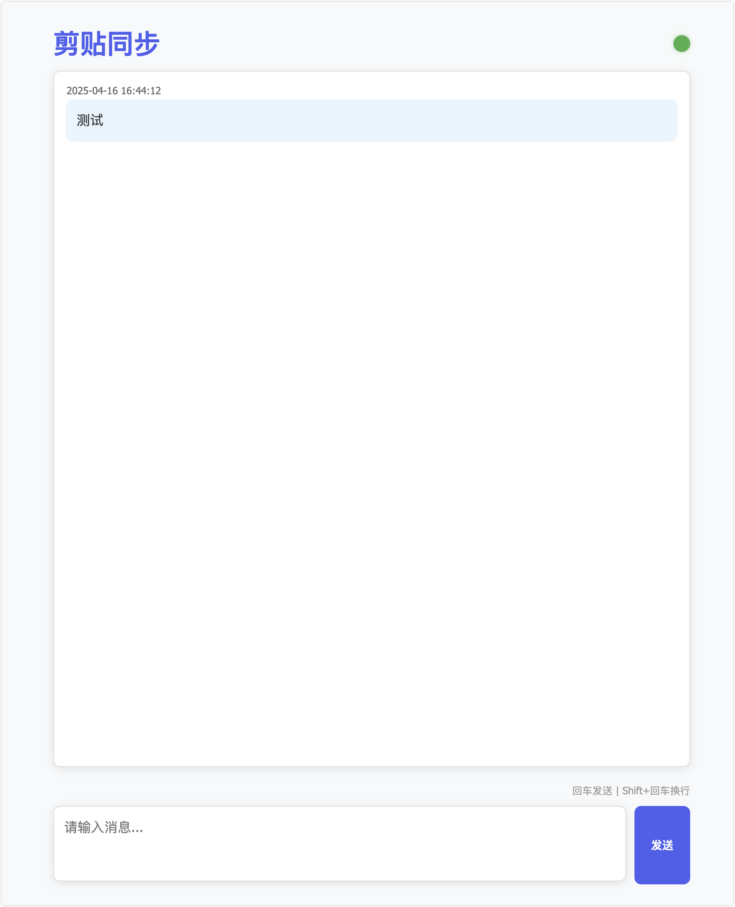
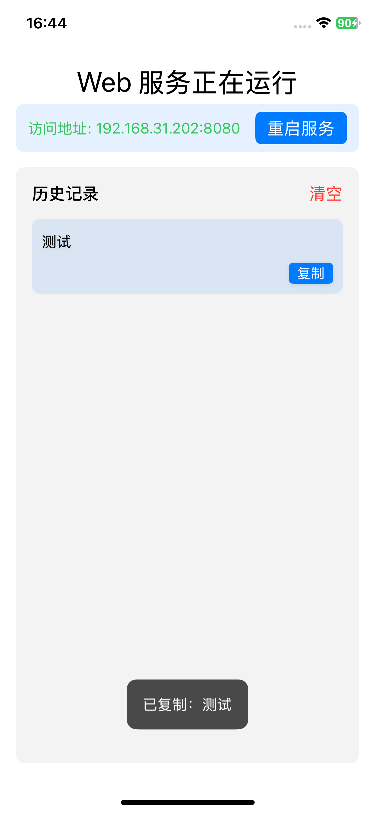

# ClipSync

ClipSync 是一个基于 SwiftUI 开发的 iOS 剪贴板同步工具，它允许你通过本地网络在不同设备间快速将内容发送到ios剪贴板。

## 功能特点

- 🔄 实时剪贴板同步
- 🌐 本地网络 Web 服务器
- 📱 支持 iOS 后台运行
- 📋 剪贴板历史记录管理
- 🔔 通知提醒功能
- 💻 简洁的 Web 界面
- 🔒 安全可靠的本地网络传输





## 系统要求

- iOS 13.0 或更高版本
- Xcode 12.0 或更高版本（用于开发）
- 支持 Swift 5.0 或更高版本

## 安装说明

1. 克隆项目到本地：
```bash
git clone https://github.com/yourusername/ClipSync.git
```

2. 使用 Xcode 打开 `ClipSync.xcodeproj` 文件

3. 选择目标设备或模拟器

4. 点击运行按钮或使用快捷键 `Cmd + R` 构建并运行项目

## 使用方法

1. 启动应用后，应用会自动在本地网络中启动 Web 服务器
2. 在浏览器中访问显示的地址（例如：`http://192.168.1.100:8080`）
3. 在 Web 界面中输入要同步的文本内容
4. 点击发送按钮，内容将自动同步到 iOS 设备的剪贴板
5. 在 iOS 应用中可以查看历史记录，并可以随时复制之前的内容

## 技术实现

- 使用 SwiftUI 构建现代化用户界面
- 采用 NIO 框架实现高性能 Web 服务器
- 支持后台任务处理
- 实现本地通知系统
- 使用 UserDefaults 进行数据持久化

## 注意事项

- 应用需要在同一局域网内使用
- 首次运行时需要授予通知权限
- 建议在稳定的网络环境下使用
- 本项目由cursor辅助生成